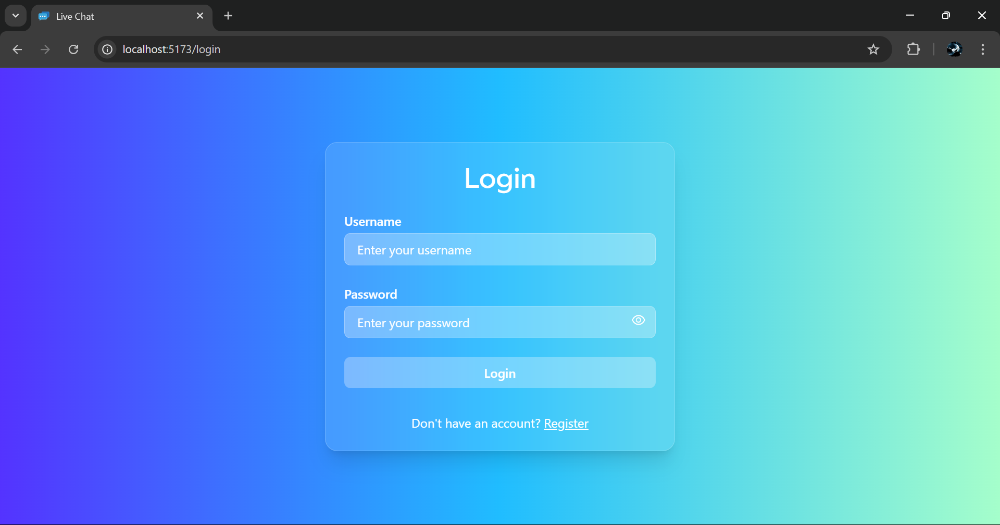
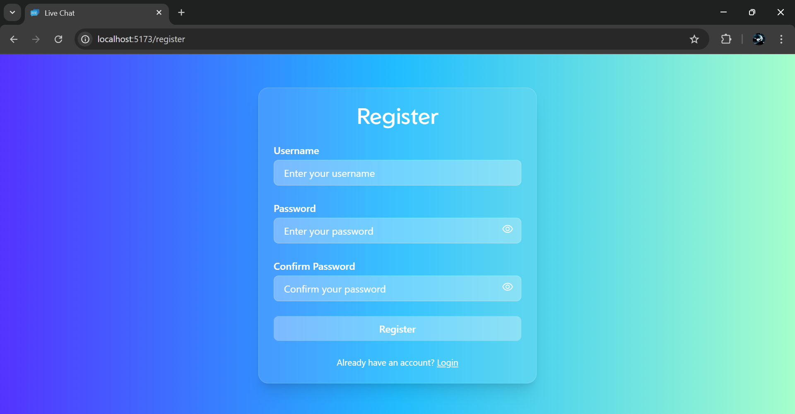
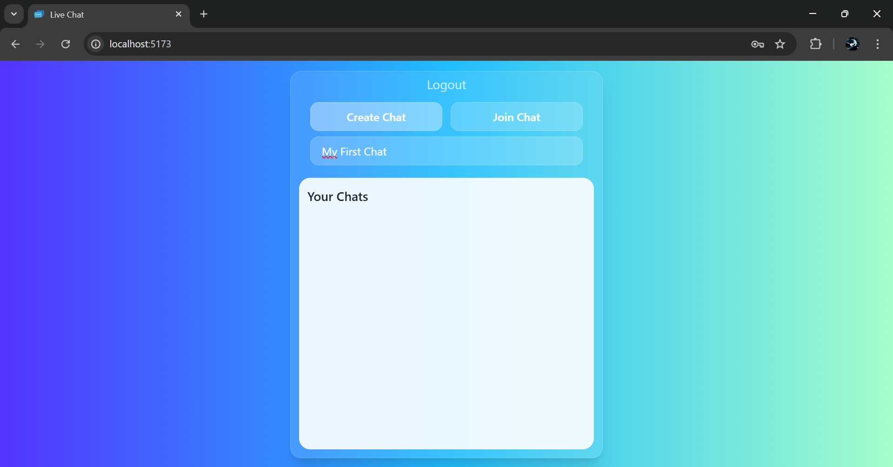
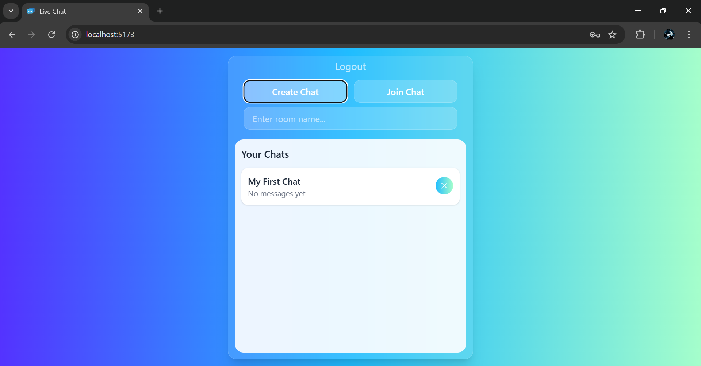
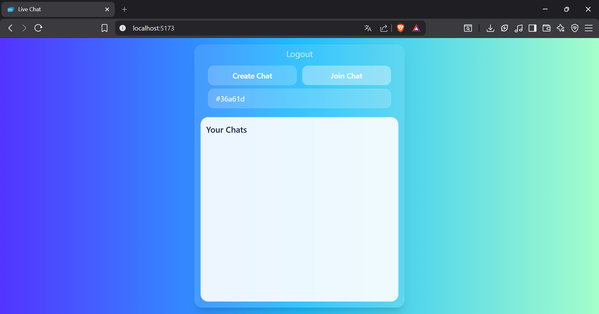
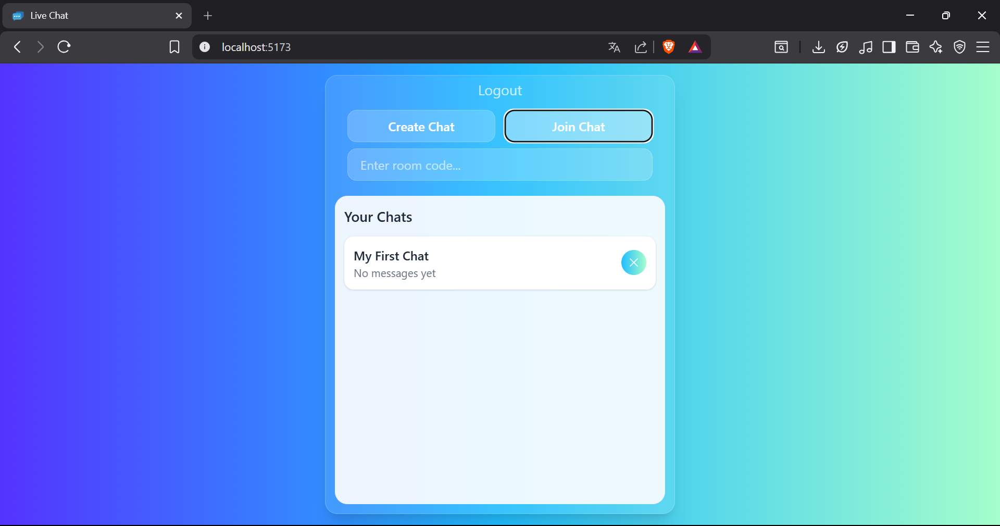
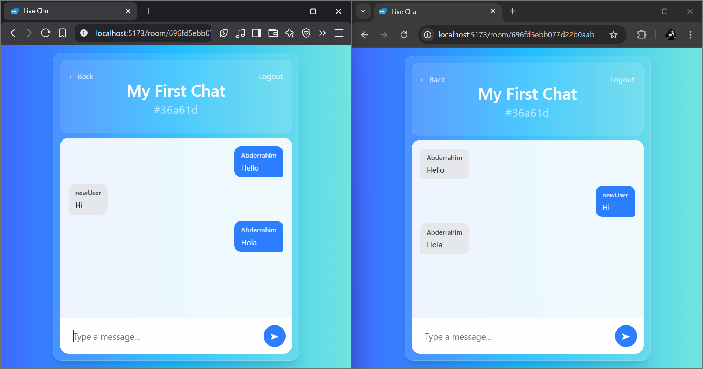

# 💬 Live Chat Web Application

## 📌 Description

A **live chat web application** that allows users to create and join chat rooms with their friends and exchange text messages in real time.  
The application uses **REST APIs** for user and room management, and **WebSockets (Socket.IO)** to enable real-time communication between users.

---

## ✨ Features

- 🔐 **User authentication** (Sign up / Log in)
- 🏠 **Create chat rooms**
- 🔑 **Join chat rooms using a unique code**
- 💬 **Send and receive messages in real time**

---

## 🛠️ Tech Stack

### 🎨 Frontend

- ⚛️ React (with Vite)
- 🧭 React Router DOM
- 🎨 Tailwind CSS

### 🖥️ Backend

- 🟢 Node.js
- 🚀 Express.js
- 🔌 Socket.IO (WebSocket communication)

### 🗄️ Database

- 🍃 MongoDB

### 🔐 Authentication & Security

- 🔑 JWT (JSON Web Tokens)
- 🔒 Password hashing

---

## 📸 Screenshots

### 🔐 Authentication




### 🏠 Creating a Chat Room




### 🔑 Joining a Chat Room




### 💬 Inside the Chat



---

## ⚙️ Installation & Setup

### 📋 Prerequisites

Make sure you have the following installed:

- 🟢 **Node.js** (v18 or higher recommended)
- 📦 **npm**
- 🍃 **MongoDB** (local installation or MongoDB Atlas)

---

### 🗄️ Database Setup

Create a **MongoDB database** (local or cloud-based).  
The required collections will be created automatically by the application.

---

### 🖥️ Backend Setup

```bash
cd backend
npm install
node server.js
```

### 🎨 Frontend Setup

```bash
cd frontend
npm install
npm run dev

```

Then open your browser at:

```bash
http://localhost:5173
```

---

### 🔐 Environment Variables

Create a .env file based on .env.example **for both frontend and backend**, and add the required configuration variables (database URI, JWT secret, API URLs, etc.).

---

### 👤 Author

Abdrahim Benali

Software Engineering Student at INPT
